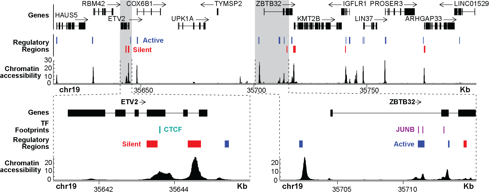
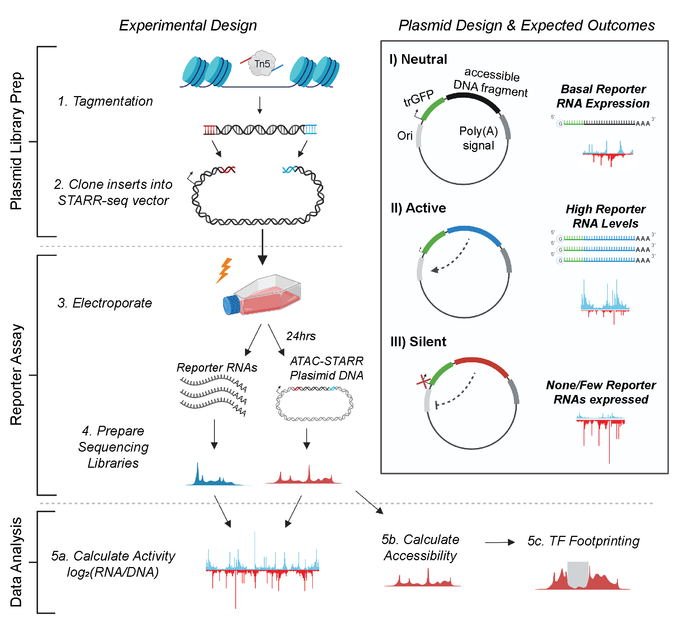

# __ATAC-STARR-seq__

__ATAC-STARR-seq__ is a _three-in-one_ approach that simultaneously profiles chromatin accessibility, transcription factor (TF) occupancy and regulatory activity of human genomes by pairing ATAC-seq (assay for transposase-accessible chromatin using sequencing) with STARR-seq (self-transcribing active regulatory region sequencing). Check out our publication in [Genome Research](https://genome.cshlp.org/content/early/2022/07/18/gr.276766.122.abstract)! 

View my interactive protocol on [protocols.io](https://www.protocols.io/view/atac-starr-seq-rm7vz896rvx1/v2) to perform ATAC-STARR-seq in your own lab! And check out the ATAC-STARR code repository on [GitHub.com](https://github.com/HodgesGenomicsLab/ATAC-STARR-seq) for some useful python scripts. 

***

### __What information does it provide?__

__ATAC-STARR-seq__ provides the following _-omics_ on an __unbiased__ and __global__ scale: 

* Regulatory Acitivity
* Chromatin Accessibility
* TF footprinting

***

### __How does it work?__

The __ATAC-STARR-seq__ approach is divided into the three general parts: 

1. ATAC-STARR-seq Plasmid Library Generation
2. Reporter Assay
3. Data Analysis  

To generate ATAC-STARR-seq plasmid libraries, nuclei are isolated from a cell type of interest and exposed to Tn5, the cut-and-paste transposase used in the ATAC-seq method. Tn5 simultaneously cleaves DNA fragments within accessible chromatin and attaches customizable sequence adapters to their 5’ ends. ATAC-STARR-seq adapters are designed to serve as homology arms for direct Gibson cloning into the STARR-seq reporter plasmid, which enables cloning of accessible DNA fragments en masse. The resulting ATAC-STARR-seq plasmid library consists of millions of unique plasmids each harbouring their own unique open chromatin-derived DNA fragment. 

In our improved ATAC-STARR-seq workflow, we employ the STARR-seq Ori backbone, where the origin of replication (Ori) functions as the minimal promoter (Muerdter et al. 2018). Each plasmid in the ATAC-STARR-seq plasmid library contains a truncated GFP (trGFP) coding sequence, a poly-adenylation signal sequence, the Ori, and the unique accessible DNA fragment being assayed. Critically, the accessible region is cloned into the 3’ UTR, so if the accessible region is active, it interacts with the Ori to drive self-transcription. Thus, an accessible region’s level of activity is reflected by its own level of expression. Importantly, transcripts from ATAC-STARR-seq plasmids, termed “reporter RNAs”, are expressed at basal levels from the activity of the Ori itself. This allows detection of silencing activity—the inhibition of the basal expression—in this assay. 

Following its creation, the ATAC-STARR-seq plasmid library is transfected via electroporation into a given cell line. From the same flask of cells, both reporter RNAs and plasmid DNA are harvested 24 hours later, then prepared as Illumina sequencing libraries and sequenced. Activity is calculated as the log2 ratio between normalized read counts from the reporter RNA and plasmid DNA datasets.
