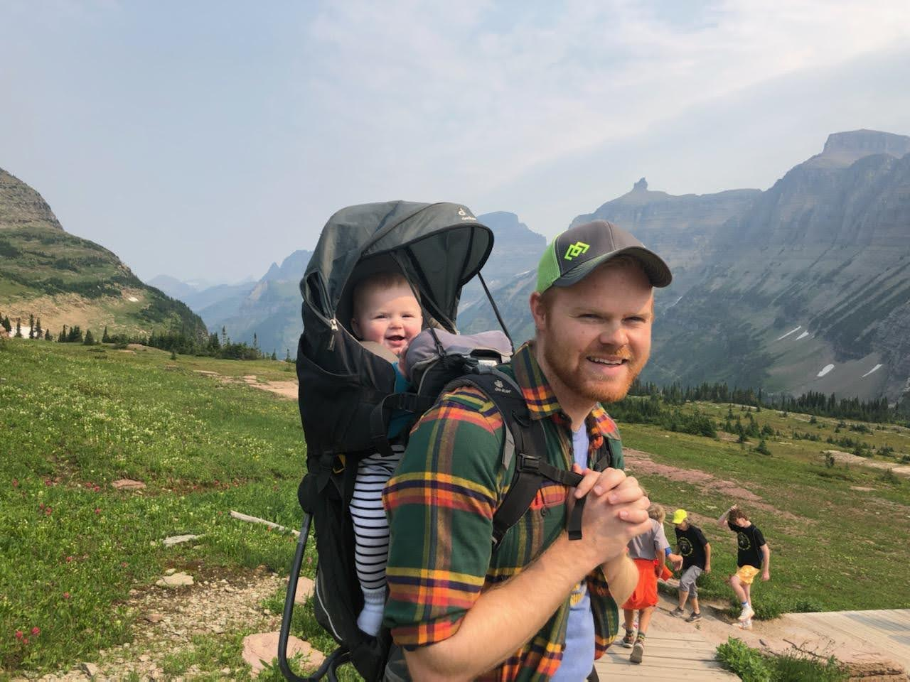

I'm a 5th grad student in Dr. Emily Hodges Lab at Vanderbilt University. In the Hodges Lab, I develop and apply or use existing functional genomic technologies to understand gene regulatory evolution of humans. Specifically, I've developed __ATAC-STARR-seq__, a massively parallel reporter assay that quantifies regulatory activity of accessible chromatin.   

I'm currently 50/50 computational/experimental. This allows me to generate and analyze large functional genomic datasets, such as ATAC-STARR-seq. Along with fellow labmates, I've written __HodgesTools__, an R package that contains common-use functions to analyze various genomic datasets. In addition to __R__, I've written several __python__ scripts for public use, including a script for ATAC-STARR-seq peak calling. I've also written tutorials and common-use __bash__ functions like _read-ini_ that can be viewed on my [GitHub](https://github.com/tyler-hansen). 

On the _life_ side of work-life balance I enjoy hiking with my family, watching baseball, reading science fiction, and playing chess. Feel free to [play me](https://play.chess.com/1oKWt) sometime!

Before Grad School, I majored in __Biochemistry__ at the University of Wisconsin-Madison and worked as an undergraduate researcher in Dr. Judith Kimble's lab. In the Kimble lab, I studied the molecular processes that dictate stem cell self-renewal and differentiation decisions in the _C. elegans_ germline. After graduating in 2015, I did a two-year postbac in Dr. Andy Golden's lab at the National Institutes of Health, where I used CRISPR/Cas9 to model rare human diesases in _C. elegans_ to discover dysfunctional genetic pathways that underlie rare disease. 

